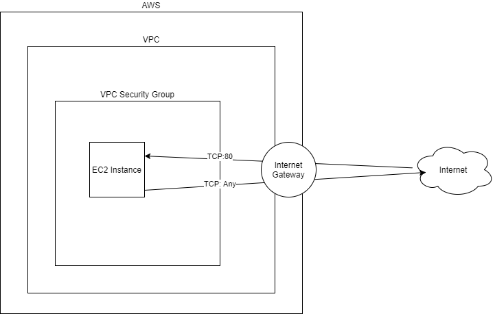

# tf_helloworld

O propósito deste projeto é criar e hospedar um html que exiba a mensagem "Hello World" sendo provisionado via terraform.

**Índice**
   * [Sobre o projeto](#Sobre-o-projeto)
   * [Estrutura](#Estrutura)
   * [Pré Requisitos](#Pré-requisitos)
   * [Rodando o código](#Rodando-o-código)
   * [Tecnologias e recursos](#Tecnologias-e-recursos)
   * [Contatos](#Contatos)

***

## Sobre o projeto

Foi criado uma instância EC2 pelo terraform e instalado o apache para mostrar o hello world no navegador. No "user_data" foi inserido os comandos que irão ser rodados ao iniciar a instância, sendo eles a instalação do apache e a adição da frase "hello world" no arquivo index.html no diretório /var/www/html/. Para acessar o apache, foi preciso anexar "aws_security_group" no EC2 para conceder acesso na porta 80.

***

## Estrutura



***

## Pré Requisitos

Antes de começar, você vai precisar ter o [Terraform](https://www.terraform.io/) instalado em sua máquina e uma conta na [AWS](https://aws.amazon.com/pt/) com a variável de ambiente configurada.
Além disto é bom ter um editor para trabalhar com o código como o [Visual Studio Code](https://code.visualstudio.com/).

***

## Rodando o código

```bash
Clone este repositório
$ git clone <https://github.com/gersonborgesbatista/tf_helloworld.git>

Acesse a pasta do projeto no terminal
$ cd tf_helloworld

Inicie o terraform
$ terraform init

Verifique as configurações antes de executar efetivamente
$ terraform plan

Execute o código
$ terraform apply
```

***

## Tecnologias e recursos

* AWS https://aws.amazon.com/pt/
* Draw.io https://app.diagrams.net/
* Terraform https://www.terraform.io/
* Visual Studio Code https://code.visualstudio.com/
* Curso AWS com Terraform https://www.udemy.com/course/aws-com-terraform/

***

## Contatos

Para qualquer pergunta ou feedback, sinta-se à vontade para entrar em contato:

* E-mail: gerson.borges@live.com
* Linkedin: https://www.linkedin.com/in/gerson-borges/
